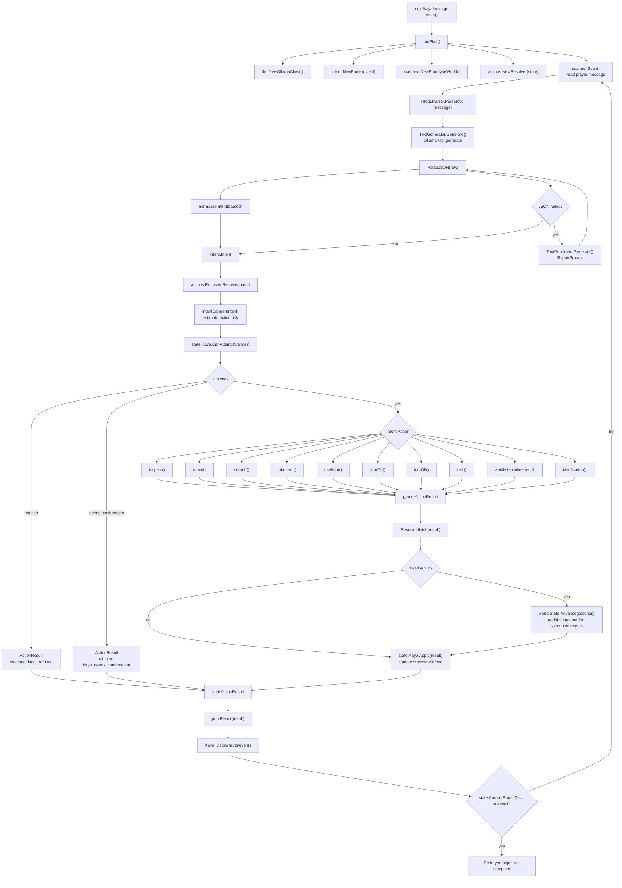
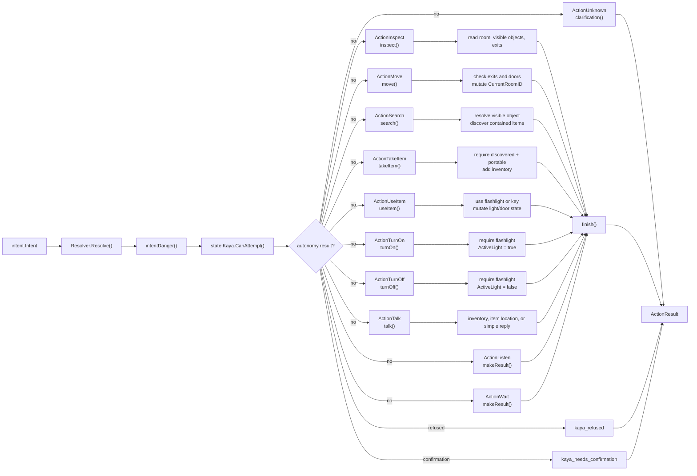
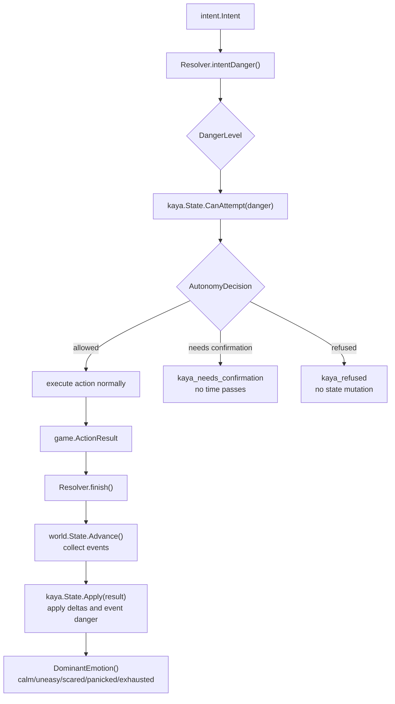

# Kaya Game Loop Function Graph

This is the main console loop from player text to Kaya's reply.



## Resolver Dispatch

`Resolver.Resolve()` is the central game-action router. The parser only says what the player probably meant. The resolver decides what is possible in the current world.



## Kaya Autonomy And Emotion

Phase 4 adds a deterministic autonomy layer. It checks risky actions before execution and updates Kaya's emotional state after successful engine results.



## File Map

- `cmd/kaya/main.go`: console entrypoint, play loop, playtest runner, printing.
- `internal/intent/parser.go`: LLM call, JSON parsing, repair, light normalization.
- `internal/intent/prompt.go`: instructions and examples for the LLM intent parser.
- `internal/actions/resolver.go`: turns an intent into game behavior.
- `internal/kaya/autonomy.go`: refusal, confirmation, and emotional state updates.
- `internal/kaya/state.go`: stress, trust, fear, pain, exhaustion.
- `internal/world/state.go`: current room, inventory, discoveries, light, visible objects.
- `internal/world/clock.go`: time advancement and scheduled events.
- `internal/scenario/prototype.go`: prototype map, rooms, objects, items, doors.

## Mental Model

The loop is:

```text
player text
-> LLM intent JSON
-> Go validates/normalizes
-> Kaya autonomy checks risky actions
-> Resolver checks world rules
-> State changes
-> Kaya stress/fear/trust updates
-> Kaya speaks visible facts
-> repeat
```

The important boundary is:

```text
LLM decides intention.
Go decides truth.
```
