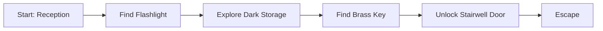

# Phase 5 Research - Randomized Runs And Common PCG Patterns

This research note expands Phase 5 beyond "move items randomly." The goal is to add replayable variation while preventing impossible runs.

Core rule:

```text
Randomness may propose content.
The deterministic engine must prove that content is playable.
```

## Sources Reviewed

- [Procedural Content Generation in Games: A Survey with Insights on Emerging LLM Integration](https://arxiv.org/abs/2410.15644)
- [Two-step Constructive Approaches for Dungeon Generation](https://arxiv.org/abs/1906.04660)
- [Illuminating the Space of Dungeon Maps, Locked-door Missions and Enemy Placement Through MAP-Elites](https://arxiv.org/abs/2202.09301)
- [Generative Adversarial Network Rooms in Generative Graph Grammar Dungeons for The Legend of Zelda](https://arxiv.org/abs/2001.05065)
- [Rooms and Mazes: A Procedural Dungeon Generator](https://journal.stuffwithstuff.com/2014/12/21/rooms-and-mazes/)
- [Go `math/rand` package](https://pkg.go.dev/math/rand)
- [Go language spec: map iteration order](https://go.dev/ref/spec#For_statements)

## Common PCG Patterns

### 1. Constructive Generation

Constructive generation builds content directly using rules. It is usually fast, understandable, and easy to test.

Examples:

```text
place room
connect room
place item
place hazard
```

For Kaya, this is the best first pattern because our map is small and the important content is logical, not visual.

Use it for:

- Flashlight placement.
- Key placement.
- Optional clue placement.
- Simple hazard placement.

Avoid using it alone when a mistake can softlock the game. Pair it with validation.

### 2. Generate-And-Test

Generate-and-test means:

```text
generate candidate world
test candidate world
accept if valid
reject or retry if invalid
```

The PCG survey describes generate-and-test as a foundation for search-based PCG: generated content is evaluated before being accepted.

For Kaya, this is the core Phase 5 pattern.

Example:

```text
seed 123 creates:
- flashlight in reception desk
- key in doctor near cabinet

validator checks:
- flashlight reachable
- key reachable after flashlight
- door reachable after key
- stairwell reachable

if all pass: run is valid
```

### 3. Two-Step Generation

The dungeon-generation paper on two-step constructive approaches separates generation into:

```text
layout creation
furnishing / object placement
```

This is exactly right for Kaya's first randomized phase.

For now:

```text
layout = fixed prototype rooms
furnishing = randomized item/object placement
```

Later:

```text
layout = generated lab wing
furnishing = items, documents, hazards, bodies, events
```

This keeps Phase 5 small. We do not need full procedural maps yet.

### 4. Mission Graph / Dependency Graph

Lock-and-key generation is easiest to reason about as a dependency graph:



This is more important than the room graph.

The room graph says:

```text
Reception -> Storage -> Stairwell
```

The mission graph says:

```text
To search storage safely, need flashlight.
To unlock stairwell, need brass key.
To get brass key, may need flashlight.
```

Phase 5 should validate mission progress, not just room connectivity.

### 5. Capability-Based Reachability

The validator should model what Kaya can do with a set of capabilities.

Capabilities are things like:

```text
has_flashlight
light_on
has_brass_key
knows_password_admin
has_chemical_a
has_chemical_b
```

Validation loop:

```text
start with no capabilities
find all reachable rooms/objects/items
when an item is reachable, add its capability
repeat until no new capabilities appear
check whether objective is reachable
```

This pattern scales into Phase 9 research puzzles too.

Example:

```text
Initial capabilities:
- can_move_reception

Find flashlight:
- has_flashlight
- can_light_dark_rooms

Find key:
- has_brass_key

Unlock door:
- can_pass_stairwell_door

Win:
- can_reach_stairwell
```

### 6. Critical Path vs Optional Variation

Generated content should be split into two categories:

```text
required progression content
optional flavor content
```

Required content:

- Flashlight.
- Brass key.
- Door unlock condition.
- Escape route.
- Required documents/passwords later.

Optional content:

- Extra batteries.
- Bricks.
- Lore notes.
- False leads.
- Creepy sounds.
- Extra bodies.

Rule:

```text
Required content must be validated.
Optional content must not block progress.
```

### 7. Seeded Determinism

Every generated run needs a seed.

Use:

```go
rng := rand.New(rand.NewSource(seed))
```

The Go docs show fixed seeds produce the same output on every run. That is exactly what we need for bug reports and replay logs.

Important Go-specific warning:

Go map iteration order is not specified and not guaranteed to be stable. So do not do this inside generation:

```go
for id := range state.Objects {
    candidates = append(candidates, id)
}
rng.Shuffle(...)
```

Instead:

```go
candidates := sortedObjectIDs(...)
rng.Shuffle(len(candidates), ...)
```

Otherwise the same seed may produce different worlds because the candidate order changed before the RNG touched it.

### 8. Validation As A Solver

For Phase 5, the validator is a small puzzle solver.

It should not call:

- Ollama.
- Intent parser.
- Text matching from player input.
- Kaya response generation.

It should only inspect world data:

- Rooms.
- Exits.
- Doors.
- Objects.
- Items.
- Placement requirements.
- Visibility requirements.
- Inventory/capability requirements.

This keeps it deterministic and fast.

## Patterns To Avoid For Now

### Avoid Full Map Generation

Algorithms like room-and-maze generation are useful later, but they are too much for Phase 5. The Nystrom dungeon article is useful because it emphasizes connectivity, loops, and tunable constraints, but Kaya does not need a full generated dungeon yet.

Use later for:

- Larger lab wings.
- Optional side rooms.
- Multiple routes.

Do not use now for:

- First key/flashlight randomization.

### Avoid LLM-Generated World Truth

LLMs can suggest flavor, descriptions, and variations later. They should not decide where required items are unless the deterministic validator can reject bad output.

Bad:

```text
LLM invents "the key is in the vent" and engine accepts it.
```

Good:

```text
Engine places key in a known object.
LLM may rephrase Kaya's discovery line.
```

### Avoid Pure Probability Tables For Required Items

This is tempting:

```text
40% key in body
40% key in drawer
20% key on floor
```

But probability tables do not know whether a placement is reachable. Use tables only as candidate weights inside a validator-backed generator.

### Avoid Hidden Critical Items Without Discovery Rules

If a required item is inside an object, the object must be:

- reachable,
- visible when needed,
- searchable,
- targetable by natural language,
- not hidden behind the item it provides.

This matters for the flashlight especially.

## Recommended Phase 5 Architecture

Package:

```text
internal/rungen
```

Files:

```text
config.go
candidate.go
generator.go
validator.go
debug.go
generator_test.go
validator_test.go
```

Main types:

```go
type RunConfig struct {
    Seed int64
}

type GeneratedRun struct {
    Seed       int64
    State      *world.State
    Placements []Placement
    Validation ValidationResult
}

type Placement struct {
    ItemID   game.ItemID
    ObjectID game.ObjectID
}

type Candidate struct {
    ObjectID     game.ObjectID
    Requires     []Capability
    GrantsAccess []Capability
    Weight       int
}

type Capability string
```

Capabilities:

```go
const (
    CapabilityFlashlight Capability = "flashlight"
    CapabilityLight      Capability = "light"
    CapabilityBrassKey   Capability = "brass_key"
)
```

Validation:

```go
type ValidationResult struct {
    Valid       bool
    Reason      string
    Capabilities []Capability
    Path        []ValidationStep
}
```

## First Candidate Set

Add a few objects to the prototype:

```text
Reception Desk
Reception Floor
Collapsed Chair
Doctor Near Cabinet
Doctor Near Door
Storage Cabinet
```

Flashlight candidates:

```text
Reception Desk       requires: none
Reception Floor      requires: none
Collapsed Chair      requires: none
```

Brass key candidates:

```text
Doctor Near Cabinet  requires: light
Doctor Near Door     requires: light
Storage Cabinet      requires: light
```

This gives variation without breaking the initial puzzle structure.

## Validator Algorithm

First implementation can be explicit and small:

```text
1. Start in reception.
2. Find reachable objects without special capabilities.
3. Confirm flashlight is reachable.
4. Add flashlight/light capability.
5. Find reachable lit/dark objects with light.
6. Confirm brass key is reachable.
7. Add brass key capability.
8. Confirm stairwell door can be unlocked.
9. Confirm stairwell room is reachable.
```

Later implementation can become a general BFS over:

```text
room + capabilities
```

State node:

```go
type SolverNode struct {
    RoomID       game.RoomID
    Capabilities CapabilitySet
}
```

Edges:

```text
move through unlocked exit
unlock door if key capability exists
search object if visible/reachable
take item and gain capability
turn on flashlight if carried
```

## How This Supports Future Puzzles

The same model works for research puzzles later:

```text
find admin username -> know_admin_user
find password hint -> know_password
access terminal -> terminal_access
read chemical document -> know_formula
collect chemicals -> has_reagents
mix correctly -> can_breach_lab_door
```

So Phase 5 should not be hardcoded only around key/flashlight. It can start with those, but the data model should already be capability-shaped.

## Testing Strategy

Unit tests:

- Same seed gives same placements.
- Different seeds can give different placements.
- Generator never places flashlight behind light requirement.
- Generator never places required key behind locked stairwell.
- Validator rejects impossible flashlight placement.
- Validator rejects impossible key placement.
- Validator accepts every generated seed in a sample range, for example seeds 1..1000.

Property-style tests:

```text
for seed in 1..1000:
    run = Generate(seed)
    assert run.Validation.Valid
```

Manual playtests:

```text
go run ./cmd/kaya play --seed 10
go run ./cmd/kaya play --seed 11
go run ./cmd/kaya play --seed 12
```

Debug output should show:

```text
Seed: 12
Flashlight: Collapsed Chair
Brass Key: Doctor Near Door
Validation: valid
Path: reception -> flashlight -> storage -> key -> stairwell door -> stairwell
```

## Recommended Implementation Order

1. Add `internal/rungen` package.
2. Add `RunConfig`, `GeneratedRun`, `Placement`, `Candidate`, `Capability`.
3. Refactor prototype scenario so item placement can be cleared/reassigned.
4. Add extra searchable candidate objects.
5. Implement seeded candidate choice using sorted candidate slices.
6. Implement explicit validator for flashlight/key/stairwell.
7. Add seed reproducibility tests.
8. Add seed sweep tests.
9. Add `playtest` scripts that run several fixed seeds.
10. Later add CLI seed support.

## Recommendation For Kaya

Use this hybrid:

```text
template world
+ seeded constructive placement
+ generate-and-test validation
+ capability solver
```

Do not use full procedural map generation yet.

This gives us replayability now, while preserving the horror puzzle design. It also builds the exact machinery we need later for admin-password puzzles, chemical formulas, documents, locks, hazards, and alternate routes.
