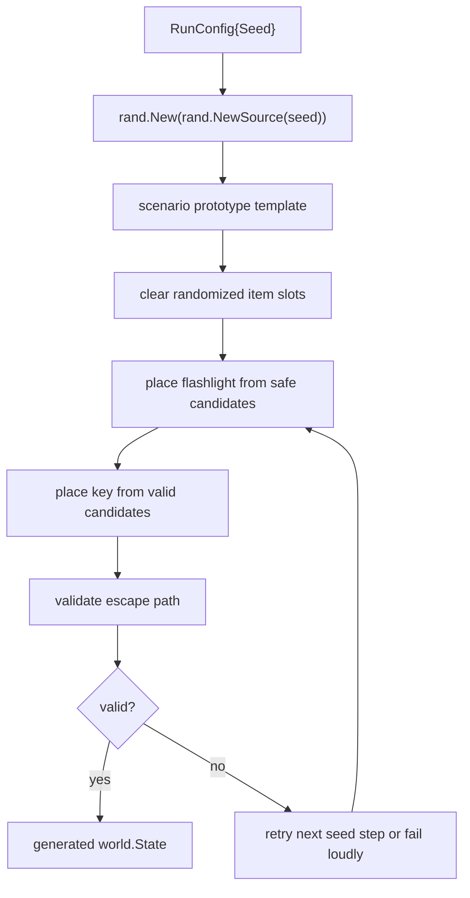

# Phase 5 - Randomized Run Generation Plan

## Implementation Status

The first focused slice is implemented:

```text
versioned SplitMix64 seed
+ unbiased Fisher-Yates placement order
+ symbolic BFS witness
+ authoritative resolver replay
= accepted playable run
```

Run a reproducible game with:

```text
kaya play --seed 12345
```

The prototype exhaustively proves all nine flashlight/key placement combinations and sweeps seeds `1..1000`. Seed `12345` was also completed end to end through `qwen3.5:4b`, the intent parser, and the real resolver.

Verification note: unit tests, race tests, vet, Ollama integration, and the CLI playthrough pass. On this Windows machine, race tests use MSYS2 UCRT64 GCC:

```powershell
$env:PATH="C:\msys64\ucrt64\bin;$env:PATH"
$env:CGO_ENABLED="1"
$env:CC="gcc"
go test -race ./...
```

Phase 5 adds roguelike variation without allowing broken runs. The key rule is:

```text
Randomness proposes a world.
Validation decides if the world is playable.
```

For deeper research and common PCG patterns, see [phase-5-randomization-research.md](phase-5-randomization-research.md).

For the formal playability proof model and implementation plan, see [phase-5-playability-proof-plan.md](phase-5-playability-proof-plan.md).

## Objective

Generate a prototype run from a seed where item placement can change, but the escape puzzle stays solvable.

The first target is small:

- Move the flashlight between safe reception locations.
- Move the brass key between valid post-flashlight locations.
- Keep the stairwell escape path valid.
- Log the seed so bugs can be reproduced.

## Core Types

```go
type RunConfig struct {
    Seed int64
}

type PlacementRule struct {
    ItemID     game.ItemID
    Candidates []PlacementCandidate
    Required   bool
}

type PlacementCandidate struct {
    ObjectID      game.ObjectID
    RequiresLight bool
    Stage         PlacementStage
}

type PlacementStage string
```

Suggested placement stages:

```go
const (
    StageBeforeFlashlight PlacementStage = "before_flashlight"
    StageAfterFlashlight  PlacementStage = "after_flashlight"
    StageAfterKey         PlacementStage = "after_key"
)
```

This gives us a simple rule:

```text
Flashlight must be before_flashlight.
Key can be after_flashlight, but not before the flashlight if it requires light.
```

## Generator Flow



## Validation Flow

The validator should not use prose or LLM output. It should reason over world data.

For the first version, validation can be simple and explicit:

```text
1. Can Kaya reach a room/object containing the flashlight without needing the flashlight?
2. After taking flashlight, can Kaya reach a room/object containing the key?
3. After taking key, can Kaya reach the locked stairwell door?
4. Can the key unlock that door?
5. Can Kaya move into the stairwell?
```

Later this can become a general graph search, but the first implementation should stay small.

## Packages

Recommended package:

```text
internal/rungen/
```

Files:

```text
internal/rungen/config.go
internal/rungen/placement.go
internal/rungen/generator.go
internal/rungen/validator.go
internal/rungen/generator_test.go
```

`internal/scenario` should keep defining the prototype content. `internal/rungen` should decide how to vary it.

## First Placement Rules

Flashlight candidates:

```text
Reception Desk
Reception Floor object, to be added
Collapsed Chair object, to be added
```

Key candidates:

```text
Doctor Near Cabinet
Doctor Near Door
Storage Cabinet object, to be added
```

Invalid examples:

```text
Flashlight inside Storage Room darkness
Key behind locked stairwell door
Key in an unreachable object
Required item inside a non-searchable object
```

## Tests

Required tests:

- Same seed produces the same flashlight/key placement.
- Different seeds can produce different placements.
- Every generated run passes escape validation.
- Validator rejects flashlight placement behind darkness.
- Validator rejects key placement behind the locked stairwell door.
- Generated world still supports the manual escape path.

## Debug Output

The console should eventually print or log:

```text
Run seed: 12345
Flashlight: Reception Desk
Brass Key: Doctor Near Door
Validation: escape path reachable
```

This is important because Phase 10 will later turn seed plus action log into replay/debug support.

## Implementation Order

1. Create `internal/rungen` package and `RunConfig`.
2. Split prototype construction into stable template plus placement step.
3. Add a small candidate list for flashlight and key.
4. Place items with seeded `math/rand`.
5. Add explicit escape validator.
6. Add tests for reproducibility and invalid placements.
7. Add `kaya play --seed <seed>` or equivalent later.

Do not add monsters, hazards, or complex procedural maps in the first Phase 5 pass. The win is proving that item randomization can be varied and still safe.
